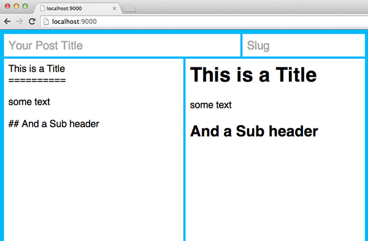

remark
======

Forward-looking Markdown editor built in React

## The `remark` npm package has recently changed!

If you're looking for jongleberry's `remark` project, you can install with `npm install remark@0.0.1`.

## Usage

`remark` exposes a render method from the main package.

```js
var remark = require('remark');

var editor = remark(document.getElementById('editor'));
```

Layout of the component is controlled by CSS Flexbox and works best if placed in an element with `display: flex` styling.

```css
/* Full Page editor */
body {
  display: flex;
  min-height: 100vh;
}
```

```js
var remark = require('remark');

var editor = remark(document.body);
```

The React component is available as `remark/component`.

```js
var React = require('react');
var Remark = require('remark/component');

var editor = React.renderComponent(Remark(), document.getElementById('editor'));
```

## Browser Support

Tested in Chrome 35, Safari 6.1.1, and Firefox 29.

Internet Explorer 10 & 11 should also be supported but are untested currently.

## Screenshot



## License

MIT
